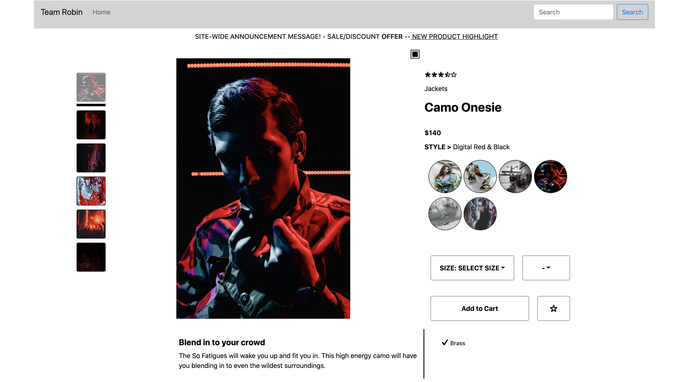
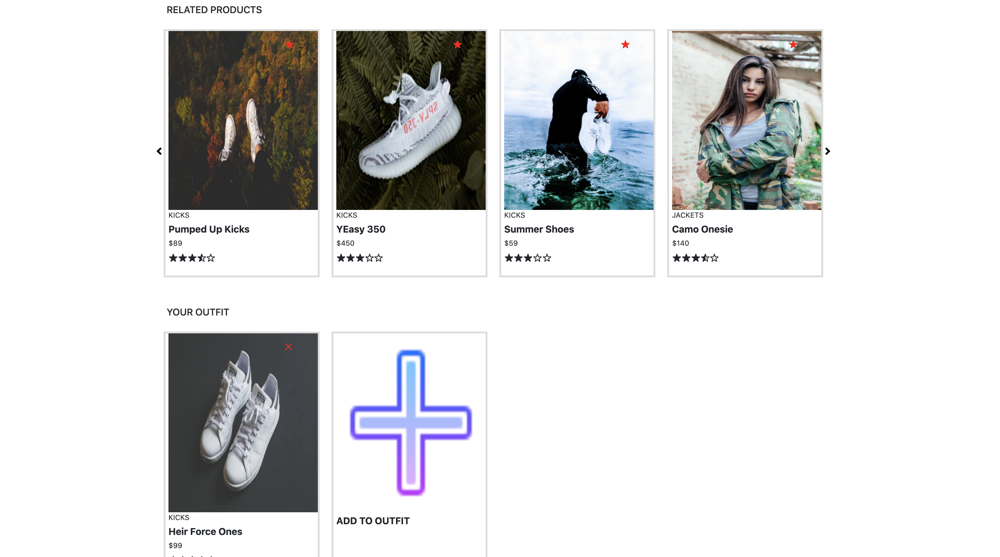
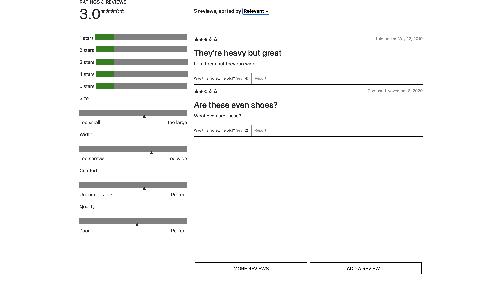

# Project-Catwalk
Welcome to our e-commerce website! This website utilizes a plethora of front-end development tools to render an e-commerce website and renders dynamically depending on what product you are trying to view. The information that the website uses to get product information comes from an API that is run elsewhere, and the page connects to it via a series of HTTP requests and responses. The bulk of this project was coded in React, with help from Webpack, SCSS, Redux, Axios, and many other tools.

## Product Details
*by Liam Murray*

This is the Product Details portion of the page, and it gives some general information on the product you're currently viewing, including styles, sizing, quantity, and other miscellaneous features. This also includes an image gallery so you can cycle throw the various images for a given product, and the various images for each style selected (the styles are located on the right hand side in the small circles). All of these components utilize an number of React Hooks that are intertwined to appropriately handle a user experience as they navigate through the page.

## Related Products
*by Deodat Ruplall*

In this section of the page, a dynamic carousel of cards display some very basic information pertaining to products related to the current product you are viewing. These cards can be clicked on and the current product of the page will be changed to the product clicked. This is mostly done using a module called React-Router, which is why you can also change the current product via the url. In addition, you can see an outfit carousel below the related products, and these can be stored by clicking the "Add To Outfit" button (the browser's localStorage is used to keep track of this information for a given user).

## Ratings and Reviews
*by J. Armando Garcia-Jacquier*

At the bottom of the webpage, you can find the Ratings and Reviews for a given product. Every product has a collection of ratings and reviews linked to it that detail certain aspects users have experienced with the product. These can include ratings based on fit, comfort, quality, and a variety of characteristics that are displayed by averaging all of these scores in a variety of bars on the left-hand side of the page. On the right-hand side, you can find a list of reviews that talk about the product. This list can be extended depending on how many reviews were given as well. Lastly, you can see a Star rating that is given for a certain product, and this Star rating can also be found on the other portions of the webpage.

## Installation

Describe the installation process
To start application run (the last two commands need to simultaneously run while in development):
* npm install
  * This command will load all necessary packages/modules into your file system so you can properly run the code to serve up the page. The "node_modules" and "package-lock.json" should be created after this command is run
* npm run react-dev
  * This code will utilize webpack and compile your files and put all dependencies into a simple 'bundle.js' file so that it the only script tag you need in your HTML
* npm run start
  * Lastly, this code will run your Express server, which will actually serve up the HTML and React App if you try and load it in the browswer

## Usage

To use application navigate to localhost:3000/products/${productID}

# Thanks for visiting!